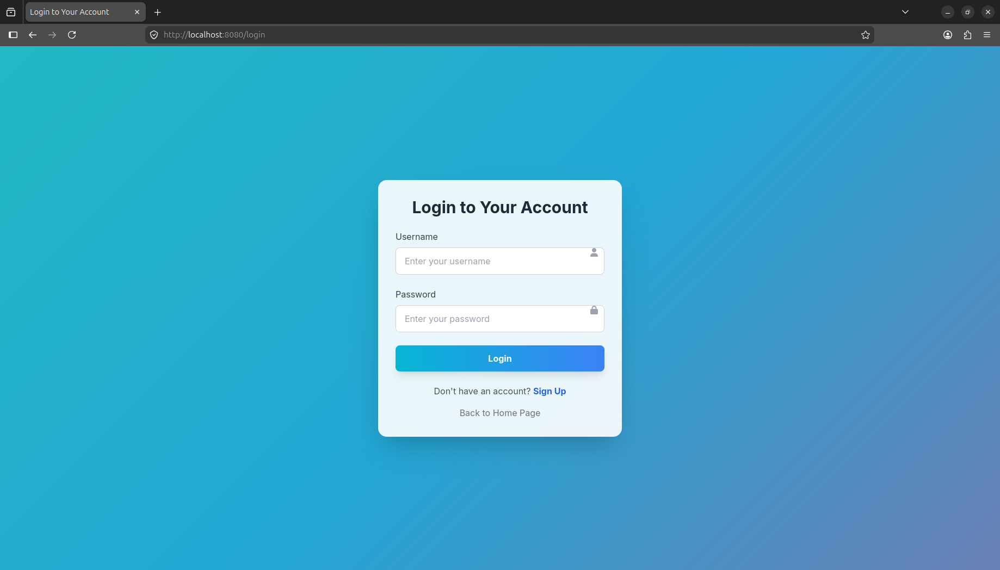
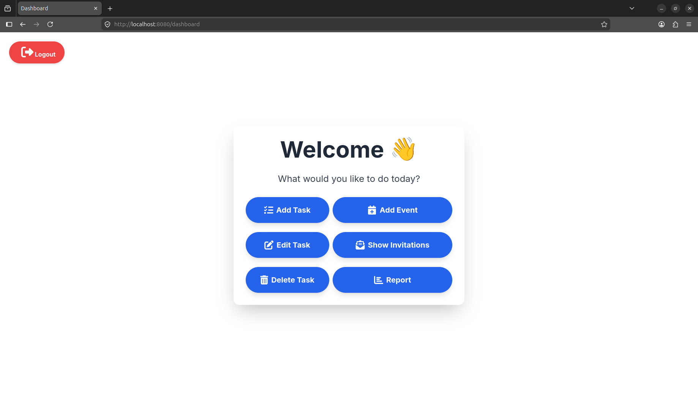
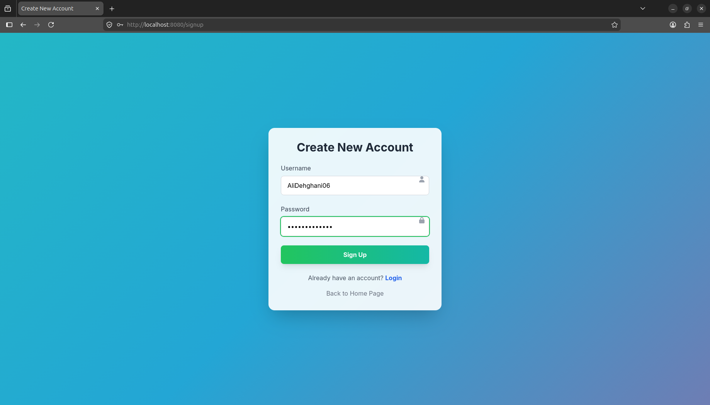
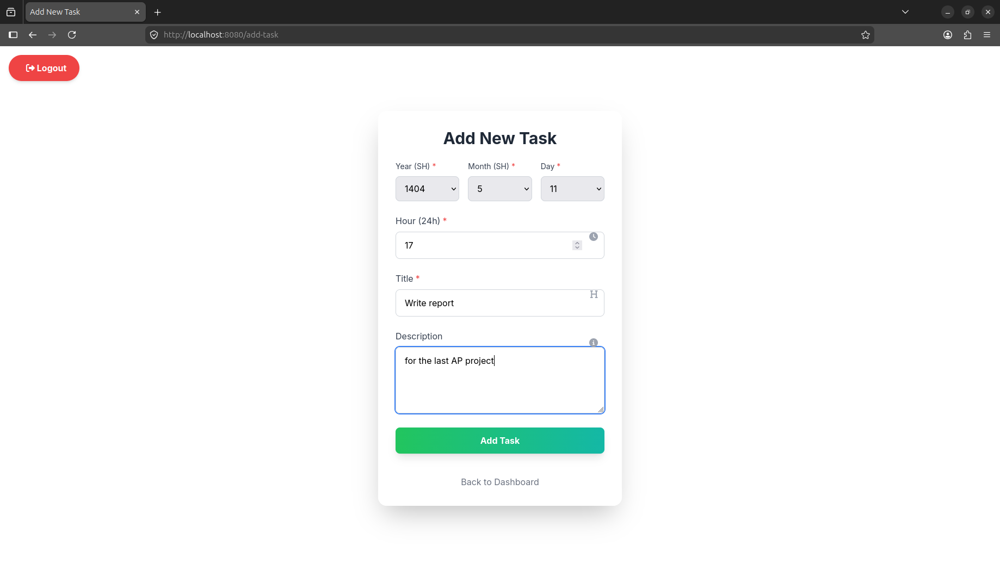
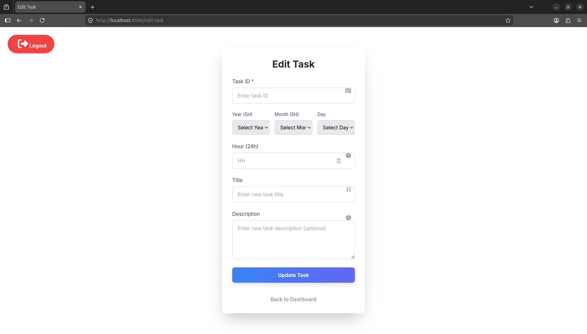
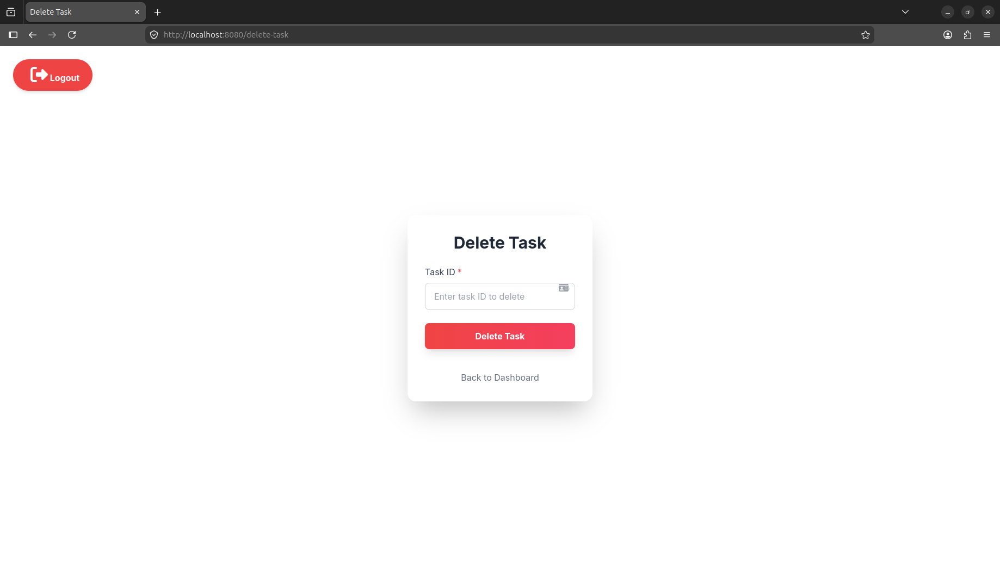
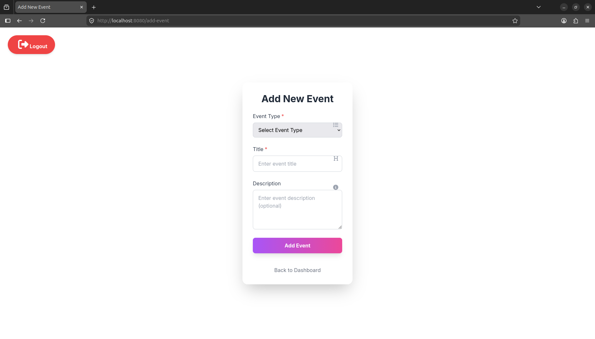
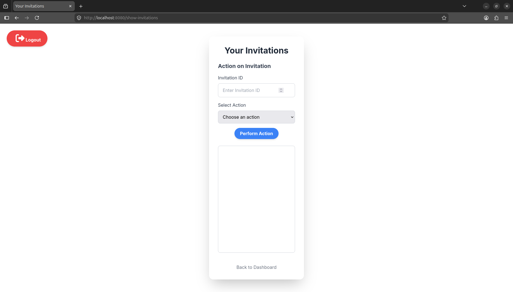
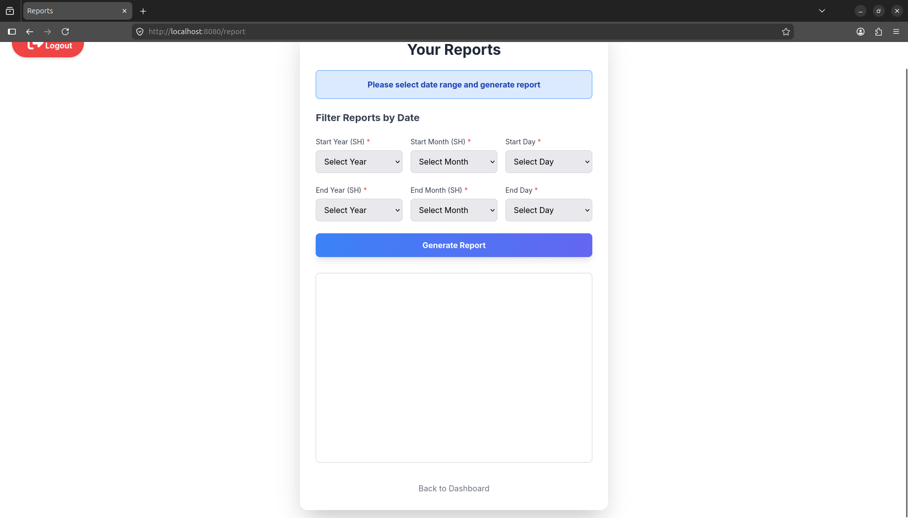
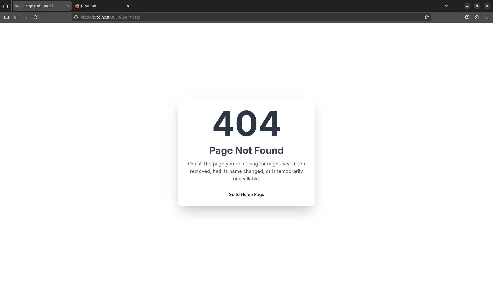

# 📅 Calendar Task Manager

<p align="center">

A lightweight **Calendar-Based Task & Event Management System** built with **C++**, featuring a custom HTTP server, user authentication, task scheduling, event management, invitation handling, and a browser-based interface.

Developed as an advanced programming project and later refined into a portfolio-ready software engineering project.

</p>

---

<p align="center">


</p>

---

## 📖 Overview

Calendar Task Manager is a web-based task and event scheduling system implemented entirely in **C++** using an educational HTTP framework.

The application enables users to create personal accounts, manage daily tasks, organize calendar events, invite other users, and generate reports through an interactive browser interface.

Unlike a traditional console application, this project follows a client-server architecture where the backend processes HTTP requests and dynamically serves web pages to users.

The project demonstrates object-oriented design principles, modular software architecture, HTTP request handling, session management, and full-stack interaction between C++ backend components and HTML/CSS/JavaScript frontend pages.

---

## ✨ Key Highlights

* ✅ Calendar-based task scheduling
* ✅ Event management system
* ✅ User authentication
* ✅ Session management
* ✅ Invitation handling
* ✅ Report generation
* ✅ HTTP server implementation
* ✅ Dynamic request handling
* ✅ Browser-based interface
* ✅ Modular object-oriented architecture

---

# 📑 Table of Contents

* [Overview](#-overview)
* [Screenshots](#-screenshots)
* [Features](#-features)
* [Technology Stack](#-technology-stack)
* [Architecture](#-architecture)
* [Project Structure](#-project-structure)
* [Installation](#-installation)
* [Running the Project](#-running-the-project)
* [Usage](#-usage)
* [Folder Structure](#-folder-structure)
* [Future Improvements](#-future-improvements)
* [Lessons Learned](#-lessons-learned)
* [Academic Context](#-academic-context)
* [License](#-license)
* [Author](#-author)

---

# 📸 Screenshots

> Screenshots below demonstrate the primary workflow of the application.

| Login                           | Dashboard                           |
| ------------------------------- | ----------------------------------- |
|  |  |

| Sign Up                          | Add Task                           |
| -------------------------------- | ---------------------------------- |
|  |  |

| Edit Task                           | Delete Task                           |
| ----------------------------------- | ------------------------------------- |
|  |  |

| Add Event                           | Invitations                           |
| ----------------------------------- | ------------------------------------- |
|  |  |

| Reports                          | Error Page                           |
| -------------------------------- | ------------------------------------ |
|  |  |

---

# ⭐ Features

## User Management

* User registration
* User authentication
* Login & logout
* Session-based authentication

---

## Task Management

* Create new tasks
* Edit existing tasks
* Delete tasks
* Calendar scheduling
* Daily task organization

---

## Event Management

* Create calendar events
* Invite users
* Manage event information
* Calendar integration

---

## Reporting

* Daily reports
* Task summaries
* Event summaries

---

## Web Application

* Browser-based interface
* HTTP request processing
* Dynamic page rendering
* Static page serving

---

# 🛠 Technology Stack

The project combines a native C++ backend with a lightweight web interface to deliver a complete browser-based task management application.

| Category             | Technology                  |
| -------------------- | --------------------------- |
| Programming Language | C++20                       |
| Backend              | Custom HTTP Server (APHTTP) |
| Frontend             | HTML5                       |
| Styling              | CSS3                        |
| Client-side          | JavaScript                  |
| Build System         | GNU Make                    |
| Data Storage         | CSV Files                   |
| Operating System     | Linux                       |
| Development Paradigm | Object-Oriented Programming |

---

# 🏛 Software Architecture

The application follows a modular architecture where each component has a well-defined responsibility.

```
                    Browser
                       │
                HTTP Request
                       │
                APHTTP Server
                       │
                 Route Matching
                       │
                 Request Handler
                       │
            Business Logic Layer
                       │
        Models & Utility Components
                       │
               CSV Data Storage
```

The backend is intentionally divided into multiple layers to improve maintainability, readability, and scalability.

---

# 🧩 Core Components

## HTTP Server

Responsible for:

* Receiving client requests
* Matching request routes
* Dispatching requests to handlers
* Returning HTTP responses

---

## Route System

The routing layer maps HTTP requests to their corresponding request handlers.

Each route consists of:

* HTTP Method
* URL Path
* Request Handler

This separation keeps the server implementation clean and allows new endpoints to be added with minimal changes.

---

## Request Handlers

Handlers act as the controller layer of the application.

Their responsibilities include:

* Reading request parameters
* Validating user input
* Managing authentication
* Executing business logic
* Rendering HTML pages
* Redirecting users

---

## Business Logic

The business layer contains the core application logic.

It is responsible for:

* User authentication
* Session validation
* Task management
* Event management
* Invitation processing
* Report generation

Separating business rules from HTTP handling improves maintainability and simplifies future development.

---

## Models

The project is organized around several core domain models.

### User

Represents an application user and stores authentication and profile information.

### Task

Represents a scheduled task associated with a calendar date.

### Event

Represents calendar events and invitations.

### Date / Day

Responsible for date calculations and calendar-related operations.

### Holiday Manager

Loads holiday information from CSV files and integrates it into scheduling logic.

---

# 🔄 Request Lifecycle

A typical request follows the process below:

```
Browser

↓

HTTP Request

↓

Server

↓

Route Matching

↓

Request Handler

↓

Business Logic

↓

Generate Response

↓

Browser
```

This workflow separates networking, routing, application logic, and presentation into independent modules.

---

# 📂 Project Structure

```
calendar-task-manager
│
├── csv/
│   └── holidays.csv
│
|   docs/
|   ├── screenshots/
|   │   ├── home.png
|   │   ├── login.png
|   │   ├── signup.png
|   │   ├── dashboard.png
|   │   ├── add-task.png
|   │   ├── edit-task.png
|   │   ├── delete-task.png
|   │   ├── add-event.png
|   │   ├── invitations.png
|   │   ├── report.png
|   │   └── error-page.png
│
├── server/
│   ├── route.cpp
│   ├── server.cpp
│   └── ...
│
├── src/
│   ├── User.cpp
│   ├── Task.cpp
│   ├── Event.cpp
│   ├── HolidayManager.cpp
│   ├── handlers.cpp
│   ├── main.cpp
│   └── ...
│
├── static/
│   ├── login.html
│   ├── dashboard.html
│   ├── report.html
│   └── ...
│
├── template/
│
├── test/
│
├── utils/
│
├── Makefile
├── README.md
└── LICENSE
```

---

# 📁 Folder Description

| Folder      | Description                              |
| ----------- | ---------------------------------------- |
| `src/`      | Core application logic and domain models |
| `server/`   | HTTP server and routing system           |
| `utils/`    | Utility classes used across the project  |
| `static/`   | HTML pages served by the backend         |
| `template/` | HTML templates                           |
| `csv/`      | Holiday data source                      |
| `docs/`     | Documentation and screenshots            |
| `test/`     | Sample input/output test cases           |

---

# 🎯 Design Decisions

Several architectural decisions were made during development to improve software quality.

### Object-Oriented Design

The application follows object-oriented programming principles by encapsulating related data and behavior into dedicated classes.

---

### Modular Source Organization

Instead of implementing the entire project inside a few large source files, functionality has been divided into independent modules with clear responsibilities.

---

### Separation of Concerns

Networking, routing, business logic, utilities, and presentation are separated into different directories to reduce coupling and simplify maintenance.

---

### Lightweight Data Storage

Rather than relying on an external database, holiday information is stored in CSV files to keep deployment simple and minimize dependencies.

---

### Browser-Based Interface

Although implemented in C++, the project provides a graphical user experience through standard web technologies (HTML, CSS, and JavaScript), making it more accessible than a console application.

# 🚀 Installation

## Prerequisites

Before running the project, ensure the following tools are installed:

* GCC/G++ with C++20 support
* GNU Make
* Linux operating system (recommended)

The project was primarily developed and tested on Linux.

---

# ⚙️ Building the Project

Clone the repository:

```bash
git clone https://github.com/AliDehghani06/calendar-task-manager.git
cd calendar-task-manager
```

Compile the project using Make:

```bash
make
```

After a successful build, the executable will be generated.

---

# ▶️ Running the Project

Run the application using the holiday dataset:

```bash
./UTrello csv/holidays.csv
```

After launching the server, open your browser and navigate to:

```text
http://localhost:<PORT>
```

> Replace `<PORT>` with the configured server port if different.

---

# 🧪 Testing

The repository contains sample test cases under the `test/` directory.

```
test/
├── 1/
├── 2/
├── ...
└── 15/
```

Each test directory contains:

* Input data (`*.in`)
* Expected output (`*.out`)

These files were used during development to validate different application behaviors.

---

# 💡 Usage

A typical user workflow is shown below.

### 1. Create an Account

New users can register through the Sign Up page.

↓

### 2. Log In

Authenticate using your username and password.

↓

### 3. Access Dashboard

The dashboard provides quick access to:

* Tasks
* Events
* Invitations
* Reports

↓

### 4. Create Tasks

Users can:

* Add tasks
* Edit tasks
* Delete tasks
* Schedule tasks

↓

### 5. Manage Events

Users may:

* Create events
* Invite participants
* Review invitations

↓

### 6. Generate Reports

Reports summarize scheduled tasks and events for selected dates.

---

# 🌐 Web Pages

The application provides multiple browser-accessible pages.

| Page        | Description              |
| ----------- | ------------------------ |
| Login       | User authentication      |
| Sign Up     | New account registration |
| Dashboard   | Main application page    |
| Add Task    | Create new tasks         |
| Edit Task   | Modify existing tasks    |
| Delete Task | Remove scheduled tasks   |
| Add Event   | Schedule calendar events |
| Invitations | View pending invitations |
| Report      | Generate reports         |
| 404         | Error page               |

---

# 📌 Main Capabilities

✔ User authentication

✔ Session management

✔ Calendar scheduling

✔ Task creation

✔ Task editing

✔ Task deletion

✔ Event creation

✔ User invitations

✔ Daily reports

✔ Holiday awareness

✔ Browser-based interaction

✔ Modular backend architecture

---

# 📊 Project Statistics

| Metric               |           Value |
| -------------------- | --------------: |
| Programming Language |           C++20 |
| Architecture         | Object-Oriented |
| HTTP Server          |          APHTTP |
| Frontend Pages       |             10+ |
| Source Files         |             40+ |
| Test Cases           |              15 |
| Build System         |            Make |
| Data Source          |             CSV |

---

# 🏗 Object-Oriented Design

The project was designed around independent classes with specific responsibilities.

Examples include:

* User
* UserManager
* Task
* Event
* HolidayManager
* Date
* Day
* Request Handlers
* Server
* Route

This design minimizes coupling while improving maintainability and code readability.

---

# 🔒 Session Management

The application supports authenticated user sessions.

After a successful login:

* User identity is stored in the active session.
* Protected pages become accessible.
* Unauthorized requests are redirected appropriately.

This demonstrates practical implementation of stateful web interactions using C++.

---

# 📅 Holiday Integration

National holidays are loaded from a CSV file.

This approach separates application logic from configuration data, allowing holiday information to be updated without recompiling the project.

---

# 📈 Scalability Considerations

Although developed as an educational project, the architecture was intentionally organized to simplify future extensions.

Potential enhancements include:

* Database integration
* RESTful APIs
* JSON serialization
* Docker support
* User roles
* Notifications
* Responsive UI
* Unit testing
* CI/CD pipelines

The modular organization makes these extensions significantly easier to implement.

# 🔌 HTTP Endpoints

The application exposes multiple HTTP endpoints for browser interaction.

## Pages

| Method | Route               | Description             |
| ------ | ------------------- | ----------------------- |
| GET    | `/`                 | Home page               |
| GET    | `/login`            | Login page              |
| GET    | `/signup`           | Registration page       |
| GET    | `/dashboard`        | User dashboard          |
| GET    | `/add-task`         | Create a task           |
| GET    | `/edit-task`        | Edit an existing task   |
| GET    | `/delete-task`      | Delete a task           |
| GET    | `/add-event`        | Create a calendar event |
| GET    | `/show-invitations` | Display invitations     |
| GET    | `/report`           | Daily reports           |

---

## API Endpoints

| Method | Route                 | Description             |
| ------ | --------------------- | ----------------------- |
| POST   | `/login`              | Authenticate a user     |
| POST   | `/signup`             | Register a new account  |
| POST   | `/logout`             | End current session     |
| POST   | `/add-task`           | Create a task           |
| POST   | `/edit-task`          | Update an existing task |
| POST   | `/delete-task`        | Remove a task           |
| POST   | `/add-event`          | Create a calendar event |
| POST   | `/action/invitations` | Respond to invitations  |
| GET    | `/api/invitations`    | Retrieve invitations    |
| GET    | `/api/report`         | Generate reports        |

---

# 🚀 Example

```bash
git clone https://github.com/AliDehghani06/calendar-task-manager.git

cd calendar-task-manager

make

./UTrello 5000 csv/holidays.csv
```

Open your browser:

```text
http://localhost:5000
```

---

# 🔍 Code Organization

The source code is intentionally divided into several independent modules.

| Module           | Responsibility             |
| ---------------- | -------------------------- |
| `server`         | HTTP server implementation |
| `route`          | URL routing                |
| `handlers`       | Request processing         |
| `User`           | User model                 |
| `UserManager`    | User management            |
| `Task`           | Task model                 |
| `Event`          | Event model                |
| `HolidayManager` | Holiday management         |
| `Date`           | Date utilities             |
| `Day`            | Calendar representation    |
| `Utilities`      | Shared helper functions    |

This organization keeps the codebase maintainable and reduces coupling between components.

---

# 📈 Future Improvements

Possible future enhancements include:

* Database integration (SQLite/PostgreSQL)
* RESTful API support
* JSON serialization
* Docker deployment
* Responsive frontend
* Password hashing
* Email notifications
* Calendar export (ICS)
* Unit testing with GoogleTest
* Continuous Integration (GitHub Actions)
* API documentation
* User roles and permissions

---

# 📚 Lessons Learned

Developing this project provided valuable practical experience in several software engineering concepts, including:

* Object-Oriented Design
* Modular Software Architecture
* HTTP Communication
* Client-Server Programming
* Session Management
* Separation of Concerns
* Build Automation using Make
* Backend and Frontend Integration
* Designing Maintainable C++ Applications

Beyond implementing features, the project emphasized writing organized, extensible, and maintainable code.

---

# 🎓 Academic Context

This project was originally developed as part of an Advanced Programming course and has since been refined into a portfolio-ready repository.

The public version focuses on software engineering practices, documentation quality, repository organization, and maintainable code structure while preserving the original educational objectives.

---

# 🙏 Acknowledgments

This project utilizes the educational **APHTTP** framework for HTTP communication.

Special thanks to the **Advanced Programming** course team for providing the infrastructure used throughout the development process.

The framework itself is **not part of this project's original implementation** and remains the intellectual property of its respective authors.

---

# 📄 License

This project is distributed under the **MIT License**.

See the `LICENSE` file for more information.

---

# 👨‍💻 Author

**Ali Dehghani**

Computer Engineering Student

GitHub

https://github.com/AliDehghani06

---

# ⭐ If You Like This Project

If you found this repository useful or interesting, consider giving it a ⭐ on GitHub.

Feedback, suggestions, and contributions are always welcome.

---

<p align="center">

Made with ❤️ using C++20

</p>
